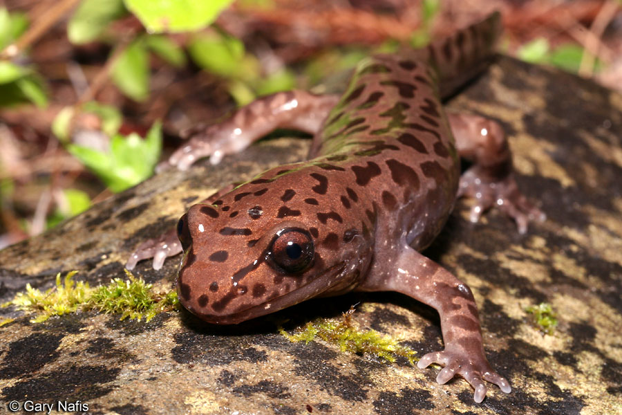

```{r setup, include=FALSE, message = FALSE, warning = FALSE, echo = FALSE}
knitr::opts_chunk$set(echo = FALSE, message = FALSE, warning = FALSE)
```

```{r}
library(tidyverse)
library(tidyr)
library(effsize)
library(RColorBrewer)
library(janitor)
library(ggbeeswarm)
library(kableExtra)
library(car)
```

```{r}
#read in data
mack_creek_vertebrates <- read_csv("mack_creek_vertebrates.csv") %>% 
  janitor::clean_names() %>% 
    mutate(unittype = case_when(
      unittype == 'P' ~ 'Pool',
      unittype == 'SC' ~ 'Side-Channel',
      unittype == 'C' ~ 'Cascade')) %>% 
  mutate(section = case_when(
      section == 'OG' ~ 'Old Growth',
      section == 'CC' ~ 'Clear Cut'))
```

```{r}
#make a table for just year, section of forest and the total counts of salamanders in each section per year
OG_vs_CC <- mack_creek_vertebrates %>% 
  select(year, section, entity) %>% 
  group_by(year, section) %>% 
  summarise(annual_count = sum(entity, na.rm = TRUE))
```



***Figure1.*** *Pacific giant salamander (Dicamptodon tenebrosus) Photo by: Gary Nafis* 

```{r, fig.align= 'center'}
#plot old growth forests and clear cut forests from 1987 to 2017
ggplot(data = OG_vs_CC, aes(x = year, y = annual_count)) +
  #plot(OG_vs_CC,xaxt = 'n')+
  #axis(1, seq(1987, 2017, 5)) +
  geom_line(aes(color = section)) +
  theme_minimal() +
  #scale_x_continuous(expand = c(0,0)) +
  scale_y_continuous(limits = c(0, 800),
                     expand = c(0,0)) +
  scale_colour_manual(values = c("salmon2", "palegreen4"))+
  scale_x_continuous(limits = c(1987, 2017)) +
  labs(x = NULL,
       y = "Annual Salamander Counts",
       title = "Annual Salamander Counts of Old Growth vs Clear Cut Forest\n(1987-2017)",
       caption = "",
       color = ""
       ) +
  theme(plot.title = element_text(size = 15,
                                  face = 4,
        hjust = 0.5)) +
  theme(plot.caption = element_text(hjust = 0, size = 8, face = "italic"))
```


```{r, include=FALSE}
#make a counts table for 2017 for OG and CC locations 
OG_CC_counts <- mack_creek_vertebrates %>% 
  filter(year == 2017) %>% 
  filter(unittype %in% c("Pool","Cascade","Side-Channel")) %>% 
  count(section, unittype)
OG_CC_counts

OG_CC_location <- OG_CC_counts %>% 
  pivot_wider(names_from = unittype, values_from = n)
OG_CC_location
```

```{r}
#pretty count table with preportions
OG_CC_table <- OG_CC_location %>% 
  janitor::adorn_percentages(denominator = "row") %>% 
  adorn_pct_formatting(digits = 1) %>% 
  adorn_ns(position = "front")

knitr::kable(OG_CC_table,
             col.names = c("",
                           "Cascade",
                           "Pool",
                           "Side-Channel"),
      caption = "Table 1. Pacific giant salamander observation locations from 2017.") %>% 
  kable_styling(bootstrap_options = "striped",
                "bordered", 
                full_width = TRUE, 
                position = "center",
                font_size = 20) %>% 
  add_header_above(c("Pacific Giant Salamander Observasions (2017)" =4))
```

```{r, include=FALSE}
#chi square test to compare if there is a significant difference in where salamanders are located between clear cut and old growth forests.
OG_CC_ct <- OG_CC_location %>% 
  column_to_rownames('section')
#there is a significant difference in where salamanders are located based on if they are in a clear cut or old growth forest.
OG_CC_chi <- chisq.test(OG_CC_ct)
OG_CC_chi
```

```{r, include=FALSE}
#compare weights of salamanders between old growth and clear cut forests
#Filter to just contain 2017 observations, weights and locations
OG_CC_weights <- mack_creek_vertebrates %>% 
  select(year, section, weight) %>% 
  filter(year == 2017) 

#mean table
OG_CC_mean_weights <- OG_CC_weights %>% 
  group_by(year, section) %>% 
  summarise(mean = mean(weight, na.rm=TRUE))

#Clear Cut mean vector for ttest
CC_mean_weights <- OG_CC_weights %>% 
  filter(section == "Clear Cut") %>% 
  pull(weight)

#Old growth mean vector for ttest
OG_mean_weights <- OG_CC_weights %>% 
  filter(section == "Old Growth") %>% 
  pull(weight)

#TTest used to find if there is a significant difference in weights of salamanders based on if they are located in a clear cut or old growth forest.
OG_CC_ttest <- t.test(CC_mean_weights, OG_mean_weights) 
OG_CC_ttest 
#There is a significant difference in mean weights between salamanders that are located in clear cut forests and those in old growth forests, p-value< 0.05

```

```{r, fig.align= 'center'}
#compare 2017 salamander weigths between channel locations

channel_location_weights <- mack_creek_vertebrates %>% 
  select(year, unittype, weight) %>% 
  filter(year == 2017) %>% 
  drop_na()

#summary table of means, sd, se, vars, sample size
channel_location_stats <- channel_location_weights %>% 
  group_by(unittype) %>% 
  summarise(mean_weight = mean(weight),
            sd_weight = sd(weight),
            sample_size = n(),
            se_weight = sd(weight)/ sqrt(n()),
            var_weight = var(weight))

#ggplot(data = channel_location_weights, aes(sample = weight)) +
  #geom_qq(aes(color = unittype),
                 #alpha = 0.5,
                 #show.legend = FALSE
          #) +
  #facet_wrap(~unittype, scales = "free")

#visual comparision between cascade, pool and side-channel weights
ggplot() +
  geom_beeswarm(data = channel_location_weights, 
                aes(x = unittype, y = weight, color = unittype),
                size = 0.7,
                alpha = 0.6,
                pch = 16,
                show.legend = FALSE) +
  scale_color_brewer(palette = "Set2") +
  scale_x_discrete(labels = c("Cascade", "Pool", "Side-Channel")) +
   geom_point( data = channel_location_stats, 
              aes(x = unittype, y = mean_weight)) +
  geom_errorbar(data = channel_location_stats,
                aes(x = unittype,
                    ymin = mean_weight - sd_weight,
                    ymax = mean_weight + sd_weight,
                    width = 0.15)) +
  theme_minimal()+
  labs(x = "",
       y = "Salamander Weight (grams)",
       title = "Weight Comparison of Pacific Giant Salamander based on\nChannel Location",
       caption = "Figure 2. ") +
  theme(plot.title = element_text(size = 15,
                                  face = 4,
        hjust = 0.5)) +
  theme(axis.title.x = element_text(size = 10)) +
  theme(axis.title.y = element_text(size = 10)) +
  theme(plot.caption = element_text(hjust = 0, size = 8, face = "italic"))
```

```{r, include = FALSE}

#Leveene Test to compare 
leveneTest(weight ~ unittype, data = channel_location_weights)
#p<0.05: 3.26e-7, assessing all 3 locations

#One-way Anova
channel_aov <- aov(weight ~ unittype, data = channel_location_weights)
summary(channel_aov)
#p<0.05: 2.14e-11, assessing weights from all three locations

# Type III Anova
channel_lm <- lm(weight ~ unittype, data = channel_location_weights)
channel_aov_t3 <- Anova(channel_lm)
channel_aov_t3

#Tukeys Test
TukeyHSD(channel_aov)
#Pool is sig different from Cascade and side-channel with a adjusted p<0.05 but cascade and side-channel are not sig different from one another with p=0.16
```


```{r, include=FALSE}
ggplot(data = channel_location_weights, aes(x = weight)) +
  geom_density() +
  facet_wrap(~unittype, scales = "free") +
  theme_minimal() 
```
